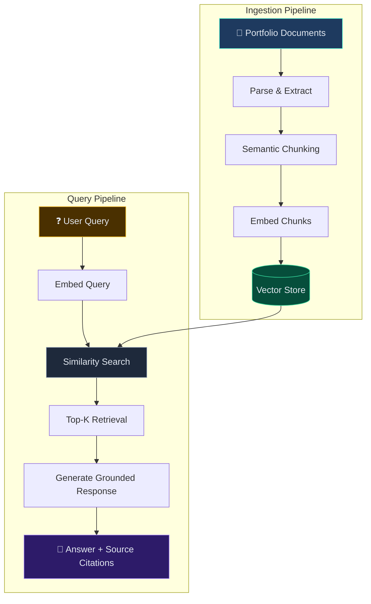

# RAG Pipeline Starter — Portfolio Q&A with Retrieval-Augmented Generation

> A self-contained RAG pipeline that ingests my portfolio/resume content, chunks and embeds it, and answers questions with source attribution — demonstrating the same architecture patterns I used in production for an enterprise document intelligence platform. No API keys required.

## What This Showcases

This demo runs a **complete RAG pipeline** over my portfolio documents — ingestion, chunking, embedding, vector search, and grounded response generation. Ask it questions about my experience and it retrieves relevant context before answering.

### Patterns Demonstrated

| Pattern | Implementation |
|---|---|
| **Document Ingestion** | Portfolio/resume content loaded as structured documents with metadata |
| **Semantic Chunking** | Overlapping word-window chunks preserving source attribution |
| **Vector Embedding** | TF-IDF word frequency vectors (mock — no API needed) |
| **Similarity Search** | Cosine similarity over all chunk vectors for top-K retrieval |
| **Grounded Response** | Answers constructed only from retrieved chunks (no hallucination) |
| **Source Attribution** | Every answer cites which documents and relevance scores were used |

## Architecture



## Running

```bash
python -m src.pipeline
```
No external dependencies — pure Python. Runs sample questions then enters interactive mode.

## Example Output

```
💬 Q: What experience does Reethika have with LangGraph?
📎 Sources: Agentic AI–Powered Data Classification System, Agentic Document Intelligence
📊 Relevance: [0.82, 0.78, 0.71]
💡 A: Based on my portfolio: Designed a multi-agent AI system using LangGraph state-machine
   orchestration for automated CDE/PII classification...
```

## Project Structure

```
src/
├── ingest.py      # Portfolio documents as the knowledge base
├── chunker.py     # Overlapping word-window chunking with metadata
├── embedder.py    # TF-IDF mock embedder (no API keys needed)
├── vectorstore.py # In-memory vector store with cosine similarity
├── generator.py   # Grounded response generation with source attribution
└── pipeline.py    # End-to-end pipeline orchestration + interactive demo
```
This repo distills that production system's core retrieval patterns into a runnable demo using my own portfolio as the document base.
