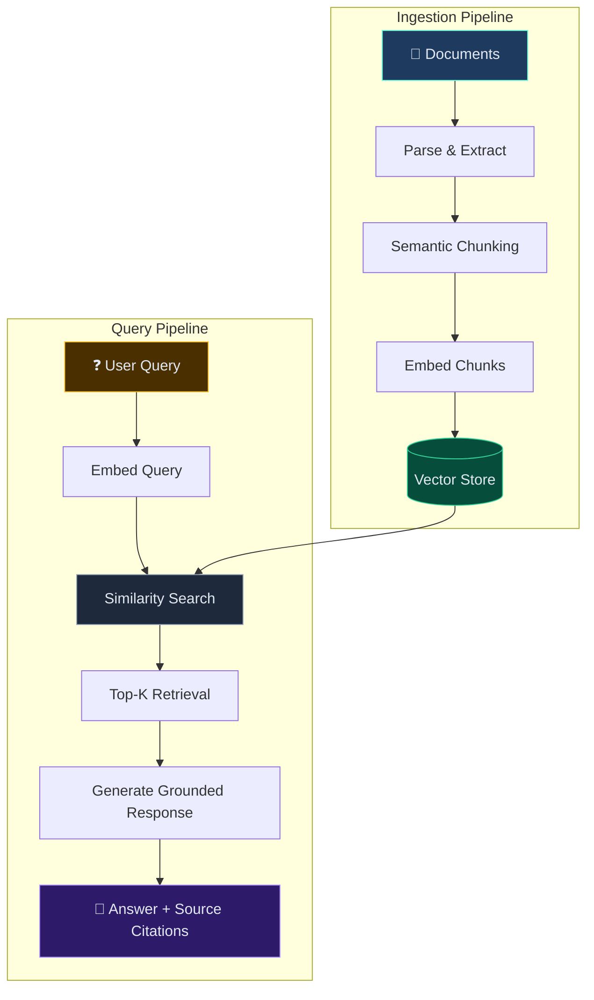

# RAG Pipeline Starter — Document Intelligence Pattern

> Demonstrates the **Retrieval-Augmented Generation pipeline** I built for an insurance enterprise client — document ingestion, semantic chunking, vector search, and grounded Q&A. No API keys required.

## What This Showcases

A self-contained prototype of the **Document Intelligence Platform** I built with LangChain/LangGraph — using mock embeddings and a local vector store.

### Patterns Demonstrated

| Pattern | Implementation |
|---|---|
| **Document Ingestion** | Load, parse, and prepare documents for embedding |
| **Semantic Chunking** | Split documents into meaningful chunks with metadata |
| **Vector Embedding** | Convert chunks to vectors (mocked — no API needed) |
| **Similarity Search** | Find relevant chunks using cosine similarity |
| **RAG Response** | Ground answers in retrieved context (mocked LLM) |
| **Source Attribution** | Every answer cites which document chunks were used |

## Architecture



## Running

```bash
pip install -r requirements.txt
python -m src.pipeline
```

## Project Structure

```
src/
├── ingest.py      # Document loading and parsing
├── chunker.py     # Semantic chunking with metadata tagging
├── embedder.py    # Mock vector embedding (no API needed)
├── vectorstore.py # In-memory vector store with cosine similarity
├── retriever.py   # Top-K retrieval with relevance scoring
├── generator.py   # Mock RAG response generation with source attribution
└── pipeline.py    # End-to-end demo runner
```
